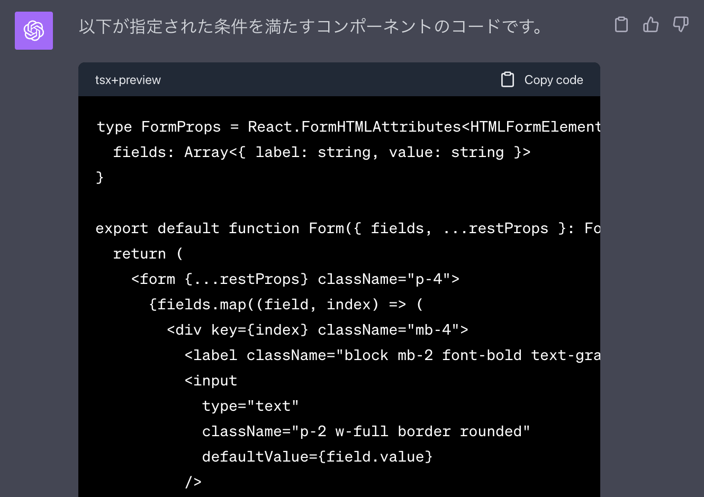
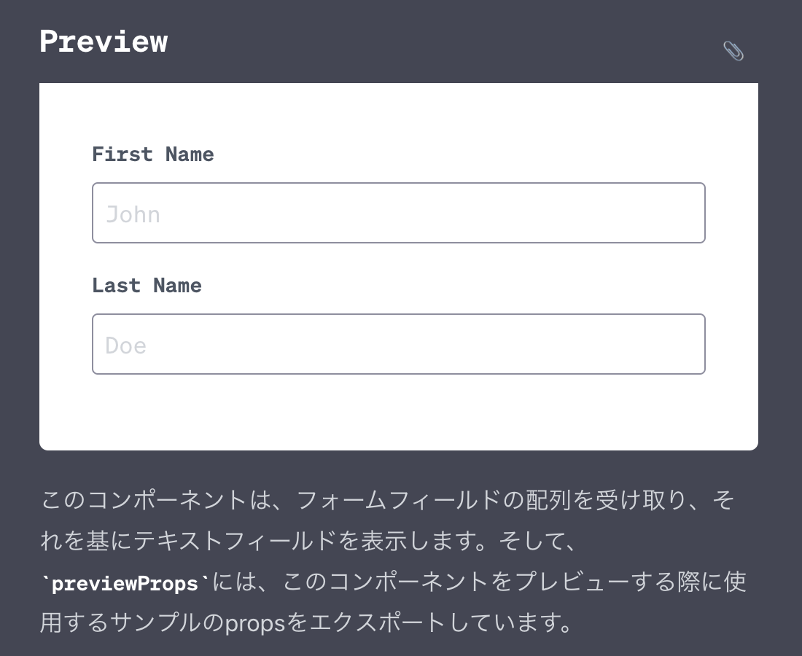

# ChatGPT Markup Preview Extension

Chrome Extension to preview markup in chat.openai.com

This extension renders html preview by code block outputs.

- code block `html+preview` => preview html directly
- code block `tsx+preview` => renderToStaticMarkup as typescript react component
- Tailwind loaded
- Click 📎 to copy as an image (for image input)

Example.





## Install

- Download latest `chatgpt-markup-preview.zip` from https://github.com/mizchi/chatgpt-markup-preview/releases
- unzip
- Open chrome://extensions and load unpacked by developper mode https://developer.chrome.com/docs/extensions/mv3/getstarted/development-basics/#load-unpacked

## Prompt Example

### HTML + Tailwind

English

````markdown
Generate a button element

- Describe it in html
- Use tailwind class for decoration
- Code block attributes should be ``html+preview
- Do not output anything but code

Output Example:

```html+preview
<div class="">Click Me</div>
```
````

Japanese

````markdown
ボタン要素を生成してください。

- html で記述してください
- 装飾には tailwind の class を使ってください
- コードブロックの属性は ```html+preview としてください
- コード以外は出力しないでください

出力例

```html+preview
<div class="">Click Me</div>
```
````

### React + Tailwind

#### Button

English

````markdown
Generate a button component.

## Condition

- Use react+tsx to write the code. jsx: "react-jsx", so import is not required.
- Use tailwind for decoration. css import is not required.
- Code block attributes should be ```tsx+preview
- Do not output anything but code
- export previewProps that satisfy the type ``props

## Example output

Example output: ```tsx+preview
type ButtonProps = { name: string }
export default function Button(props: Props) {
  return <></>
}
export const previewProps = {}
```

Translated with www.DeepL.com/Translator (free version)
````

Japanese

````markdown
ボタンコンポーネント を生成してください。

## 条件

- react+tsx で記述してください。 jsx: "react-jsx" なので import は不要です。
- 装飾には tailwind を使ってください。css の import は不要です。
- コードブロックの属性は ```tsx+preview としてください
- コード以外は出力しないでください
- props の型を満たす previewProps を export してください

## 出力例

```tsx+preview
type ButtonProps = { name: string }
export default function Button(props: Props) {
  return <></>
}
export const previewProps = {}
```
````

#### Form

English

````markdown
Generate form components.

## Props Type

FormProps = React.FormHTMLAttributes<HTMLFormElement> & {
  fields: Array<{label: string, value: string}>
}

## Conditions

- Please write in react+tsx. jsx: "react-jsx" so import is not necessary.
- Use tailwind for decoration. css import is not required.
- Code block attributes should be ```tsx+preview
- Do not output anything but code
- export previewProps that satisfy the type ``props

## Example output

```tsx+preview
type FormProps = { name: string }
export default function Form(props: Props) {
  return <></>
}
export const previewProps = {}
```

Translated with www.DeepL.com/Translator (free version)
````

````markdown
フォームコンポーネントを生成してください。

## Props Type

type FormProps = React.FormHTMLAttributes<HTMLFormElement> & {
  fields: Array<{label: string, value: string}>
}

## 条件

- react+tsx で記述してください。 jsx: "react-jsx" なので import は不要です。
- 装飾には tailwind を使ってください。css の import は不要です。
- コードブロックの属性は ```tsx+preview としてください
- コード以外は出力しないでください
- props の型を満たす previewProps を export してください

## 出力例

```tsx+preview
type FormProps = { name: string }
export default function Form(props: Props) {
  return <></>
}
export const previewProps = {}
```
````

## Local Install

```
$ pnpm install
$ pnpm build
```

- Open chrome://extensions
- Load `dist` dir